# AFL Stats App (Flutter) 🏉

A match statistics app to **manage teams & lineups**, **start/resume matches**, **live-score events**, review **past matches**, and **compare players/teams**.  
Built with **Flutter** + **Firebase**.

---

## ✨ Features
- 👥 Manage Teams & Lineups  
- 🕹️ Start / Resume Match  
- 📊 Live scoring & match details  
- 🗂️ Past matches & results  
- ⚖️ Compare Players & Teams  
- 🕒 Optional 4-Quarter system

---

## 🚀 Getting Started

~~~bash
# 1) Install deps
flutter pub get

# 2) (Recommended) Configure Firebase for your own project
#    Generates lib/firebase_options.dart
dart pub global activate flutterfire_cli
flutterfire configure

# 3) Run
flutter run
~~~

> **Security note:** Keep API keys **restricted** (by package/bundle ID & SHA-1) and only enable APIs you actually use.

---

## 📸 Screenshots (with filenames)

<table>
  <tr>
    <td align="center">
home.png
</td>
    <td align="center">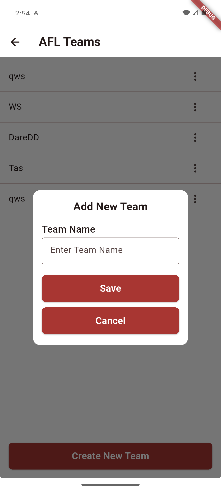
create_team.png
</td>
    <td align="center">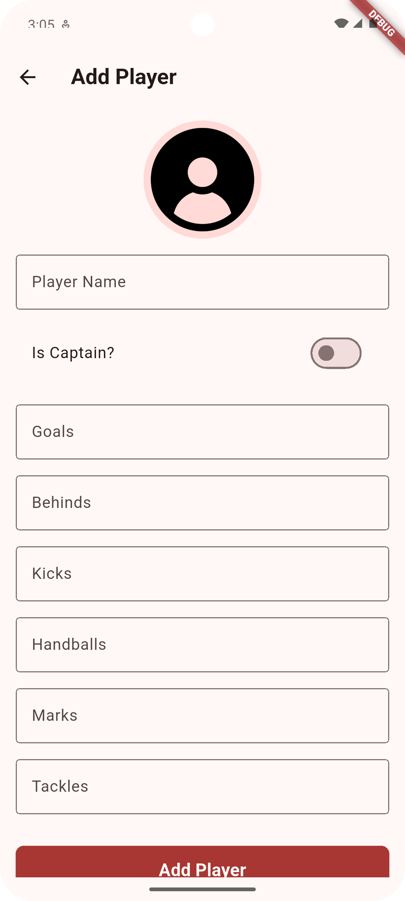
create_player.png
</td>
    <td align="center">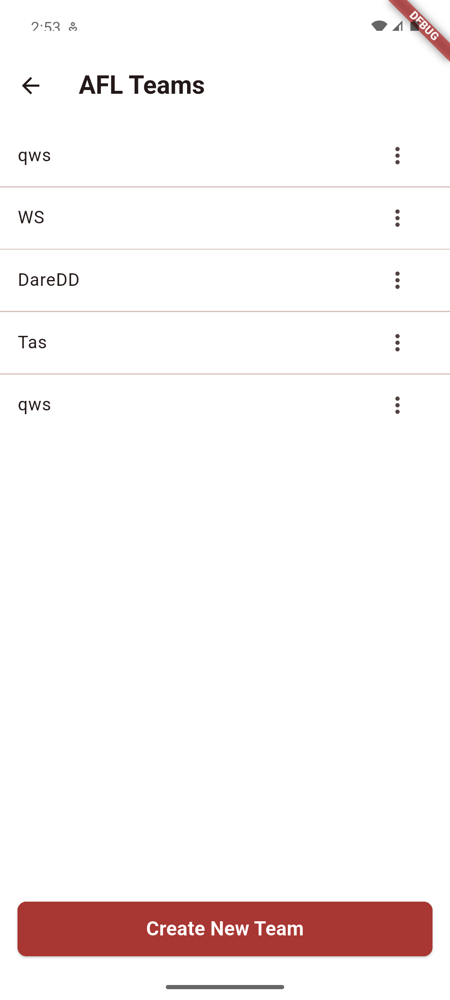
manage_team_and_lineups.png
</td>
  </tr>
  <tr>
    <td align="center">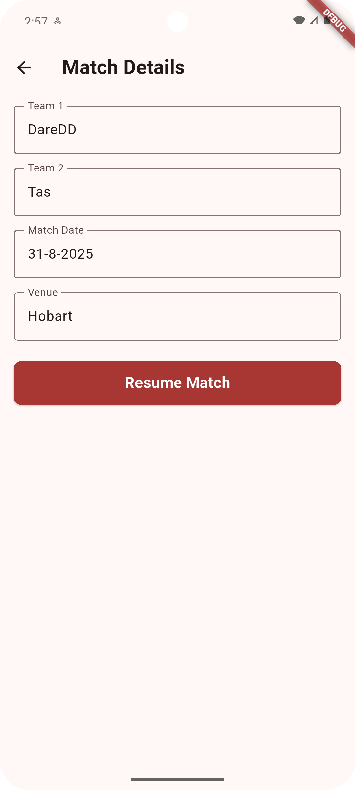
create_match.png
</td>
    <td align="center">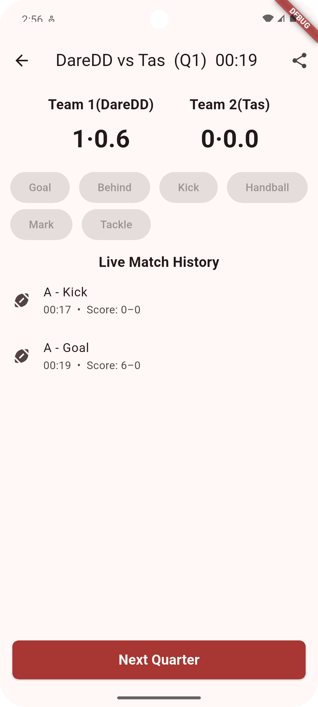
match_preview.png
</td>
    <td align="center">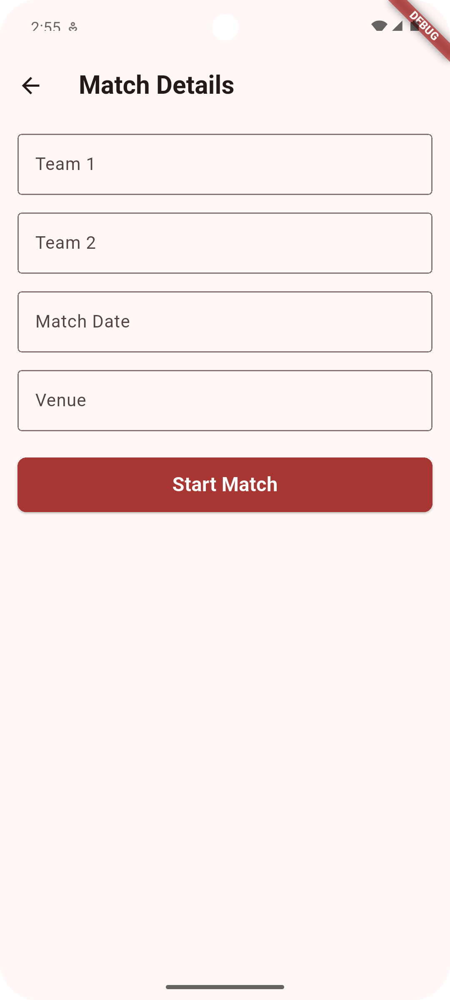
match_details.png
</td>
    <td align="center">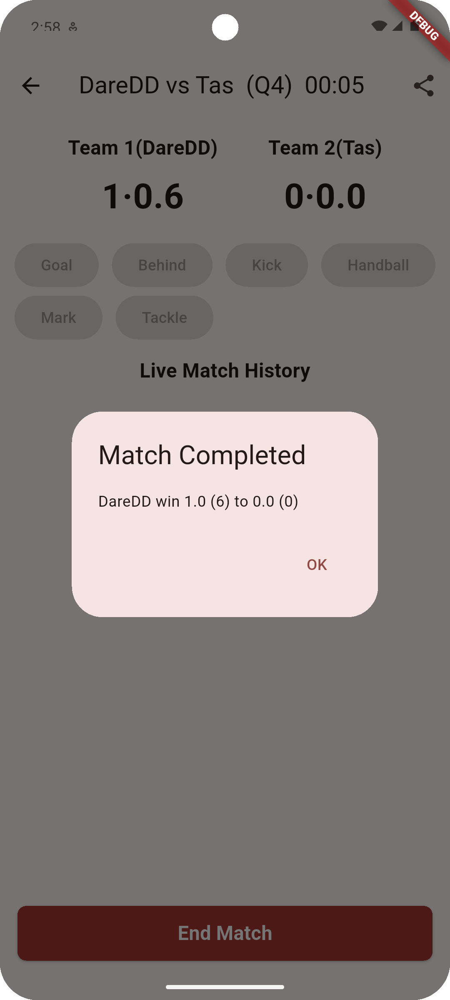
match_completed.png
</td>
  </tr>
  <tr>
    <td align="center">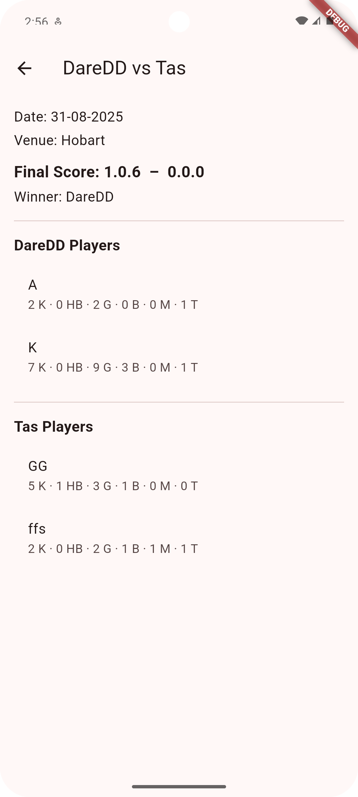
matches_result.png
</td>
    <td align="center">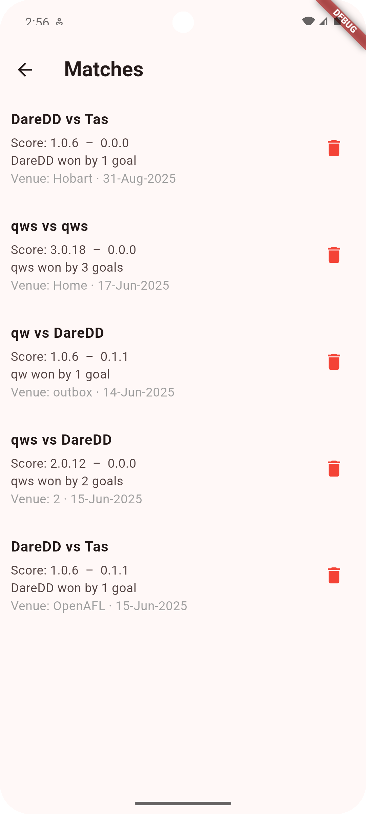
recent_matches.png
</td>
    <td align="center">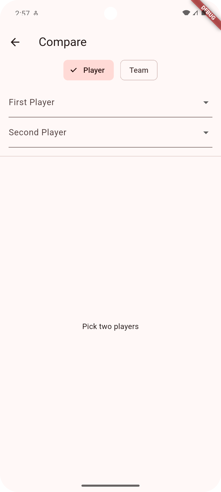
compare_players_and_teams.png
</td>
    <td align="center">
Teams Comparsion.png
</td>
  </tr>
  <tr>
    <td align="center">
Players Comparsion.png
</td>
    <td align="center">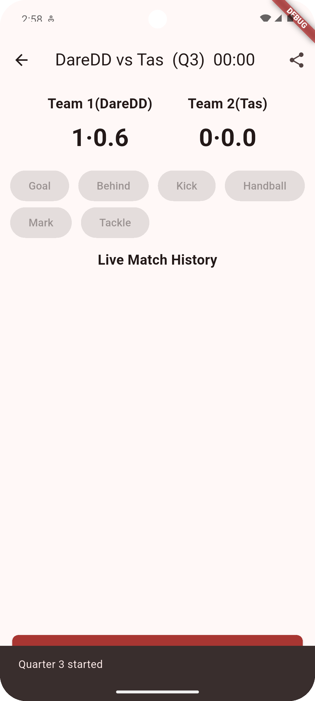
4 Quater System.png
</td>
    <td align="center">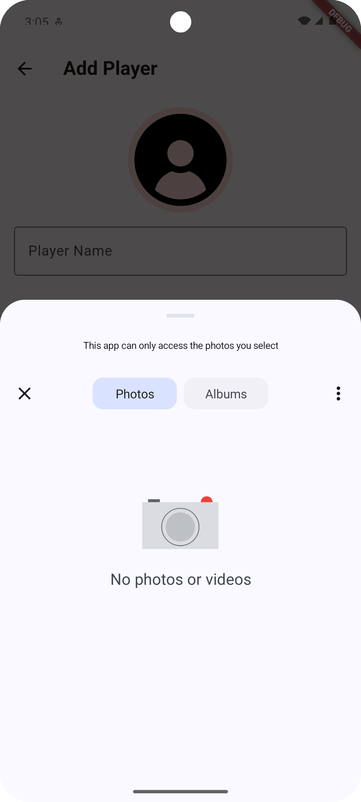
add_profile_photo.png
</td>
    <td align="center">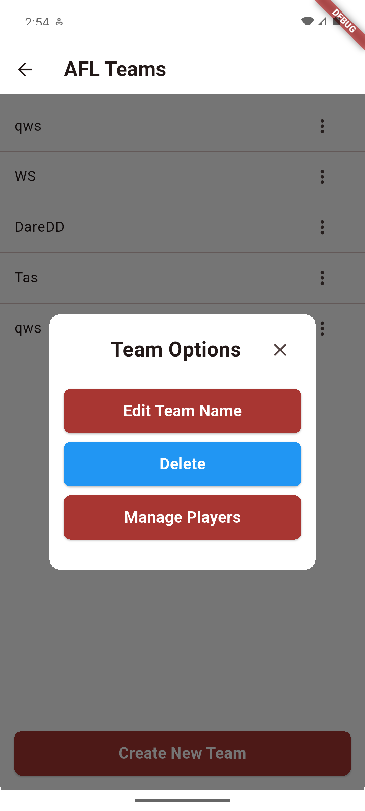
delete_team.png
</td>
  </tr>
</table>

---

## 🎥 Demo Video

<video src="media/afl-demo.mp4" width="720" controls poster="screenshots/Home.png"></video>  

If your browser doesn’t show the player, view/download directly: **[media/afl-demo.mp4](media/afl-demo.mp4)**

---

## 🧱 Project Structure (high-level)

lib/
  constants/
  controller/        # screens & controllers (home, live_score, etc.)
  models/            # data models, firebase manager
  services/          # notification_service.dart
  main.dart

---

## 🛠️ Build APK
~~~bash
flutter build apk --release
~~~
Output: `build/app/outputs/flutter-apk/app-release.apk`

---

## 📄 License
This project is licensed under the **MIT License** – see [LICENSE](LICENSE).
