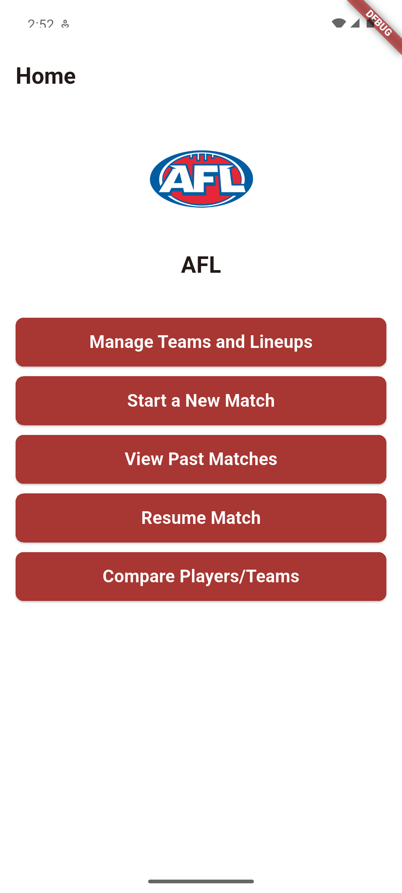

# \# AFL Stats App (Flutter)

# 

# A match statistics app to manage teams \& lineups, start matches, live-score events, review past matches, and compare players/teams.  

# Built with \*\*Flutter\*\* + \*\*Firebase\*\*.

# 

# \## Features

# \- Manage Teams \& Lineups

# \- Start / Resume Match

# \- Live scoring \& match details

# \- Past matches \& results

# \- Compare Players \& Teams

# \- Optional 4-Quarter system

# 

# \## Screenshots

# <p align="center">

# &nbsp; 

# &nbsp; 

# &nbsp; 

# </p>

# <p align="center">

# &nbsp; 

# &nbsp; 

# &nbsp; 

# </p>

# <p align="center">

# &nbsp; 

# &nbsp; 

# &nbsp; 

# </p>

# <p align="center">

# &nbsp; 

# &nbsp; 

# &nbsp; 

# </p>

# 

# > Extra:  

# > `screenshots/4%20Quater%20System.png` and `screenshots/Players%20Compersion.png` are also available.

# 

# \## Run locally

# ```bash

# flutter pub get

# flutter run

# 

